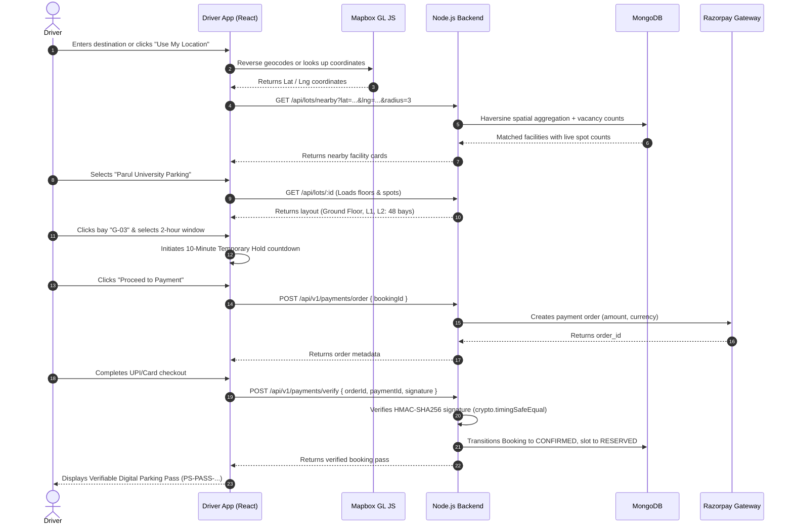
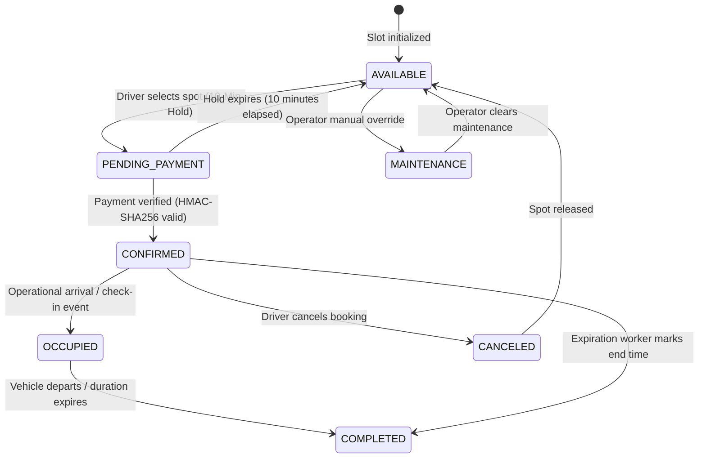
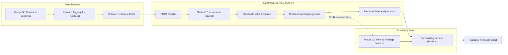
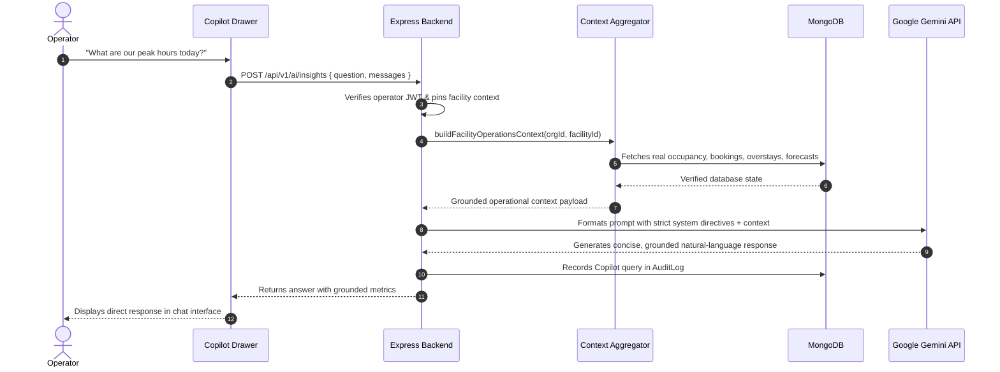
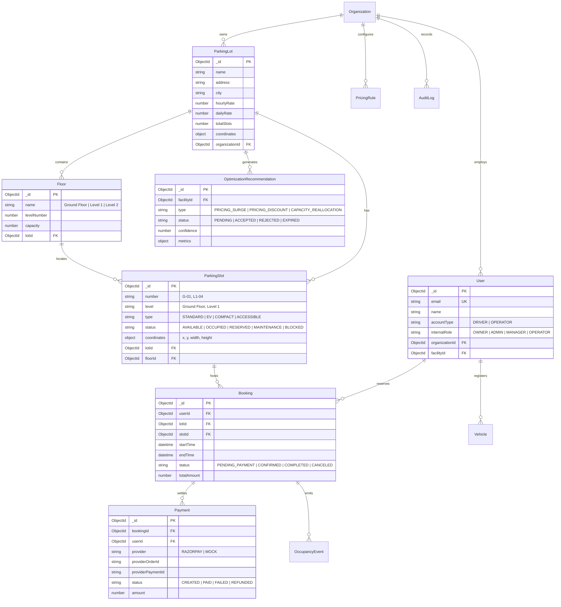

# ParkSpot

> **An AI-powered B2B parking operations and optimization platform that helps parking operators manage their facility while allowing drivers to discover, reserve, and navigate to exact parking spaces.**

[](#6-system-architecture)
[](#8-technology-stack)
[](#8-technology-stack)
[-orange.svg)](#15-machine-learning)
[](#25-testing)
[](#2-solution)

---

### Core Tenet: One Operator $\longrightarrow$ One Parking Facility

ParkSpot is built on a strict operational model: **one operator account manages exactly one parking facility**. That operator governs everything inside their facility—floors, parking bays, live occupancy, driver reservations, pricing rules, overstay alerts, demand forecasts, and optimization recommendations. 

Simultaneously, consumer drivers interact with the exact same underlying facility data: discovering nearby lots geographically, inspecting multi-level layouts, selecting specific bays, placing temporary holds, paying securely, and obtaining verifiable digital parking passes.

---

## Table of Contents

1. [Problem Statement](#1-problem-statement)
2. [Solution](#2-solution)
3. [Key Differentiators](#3-key-differentiators)
4. [User Roles & Public Account Model](#4-user-roles--public-account-model)
5. [Core Features](#5-core-features)
6. [System Architecture](#6-system-architecture)
7. [Repository Structure](#7-repository-structure)
8. [Technology Stack](#8-technology-stack)
9. [Driver Architecture & Journey](#9-driver-architecture--journey)
10. [Operator Architecture & Workflow](#10-operator-architecture--workflow)
11. [Booking System & Concurrency Control](#11-booking-system--concurrency-control)
12. [Payment Architecture](#12-payment-architecture)
13. [Dual-Map Architecture](#13-dual-map-architecture)
14. [Analytics Engine](#14-analytics-engine)
15. [Machine Learning Demand Forecasting](#15-machine-learning-demand-forecasting)
16. [Optimization Engine](#16-optimization-engine)
17. [ParkSpot Copilot (LLM Operations Layer)](#17-parkspot-copilot-llm-operations-layer)
18. [Security & Isolation](#18-security--isolation)
19. [API Architecture & Key Endpoints](#19-api-architecture--key-endpoints)
20. [Data Model & Entity Relationships](#20-data-model--entity-relationships)
21. [Authentication & Authorization](#21-authentication--authorization)
22. [Deployment Architecture](#22-deployment-architecture)
23. [Local Development Guide](#23-local-development-guide)
24. [Environment Variables](#24-environment-variables)
25. [Testing & Quality Assurance](#25-testing--quality-assurance)
26. [Architecture Decision Records (ADRs)](#26-architecture-decision-records-adrs)
27. [AI / ML Design Philosophy](#27-ai--ml-design-philosophy)
28. [Known Limitations](#28-known-limitations)
29. [Future Roadmap](#29-future-roadmap)
30. [End-to-End Request Lifecycles](#30-end-to-end-request-lifecycles)
31. [UI Interface Previews](#31-ui-interface-previews)
32. [Seed Credentials](#32-seed-credentials)
33. [License](#33-license)
34. [Author & Acknowledgments](#34-author--acknowledgments)

---

## 1. Problem Statement

Urban parking environments suffer from severe structural inefficiencies that hurt both drivers and parking operators:

### Driver Problems
- **Blind Circling & Inefficient Search:** Drivers waste an average of 15–20 minutes searching for parking near high-density hubs (transit terminals, commercial centers, campuses), increasing local congestion and fuel waste.
- **Uncertain Availability:** Drivers have no visibility into whether a facility has spaces before arriving at the gate.
- **No Space-Level Transparency:** Traditional apps book a generic "slot" in a lot, forcing drivers to hunt for an open bay inside confusing multi-level structures.
- **Pricing Ambiguity:** Lack of clear upfront rates, duration-based billing clarity, or peak surge transparency before committing.

### Operator Problems
- **Zero Real-Time Visibility:** Operators manage facilities with paper logs, static spreadsheets, or fragmented point-of-sale systems with no unified floor-by-floor occupancy overview.
- **Uncoordinated Space States:** Inability to mark individual spaces under maintenance, reserve bays for VIP/EV charging, or handle manual status overrides without disrupting the whole lot.
- **Undetected Overstays:** Vehicles staying beyond their booked departure window go unnoticed, causing cascading reservation conflicts and lost revenue.
- **Static, Inflexible Pricing:** Operators lack empirical demand data or mathematical elasticity tools to price off-peak incentives or capture peak revenue yield.
- **Data Fragmentation:** Financial, operational, and customer data reside in disconnected silos with no predictive decision support.

### Why a Simple Booking CRUD Is Insufficient
A standard CRUD reservation system creates phantom reservations, suffers from Time-Of-Check to Time-Of-Use (TOCTOU) race conditions during high demand, lacks spatial floor awareness, and offers zero business intelligence. Parking operations require **deterministic concurrency guarantees**, **spatial floor coordination**, **multi-tenant operator governance**, **predictive demand modeling**, and **context-grounded operational assistance**.

---

## 2. Solution

ParkSpot replaces fragmented manual operations and generic booking systems with an integrated software platform where both drivers and operators share a unified, real-time ground truth.

```
                  ┌──────────────────────────────────────────────┐
                  │                 PARKSPOT                     │
                  │   Unified Facility & Spot Ground Truth       │
                  └──────────────────────┬───────────────────────┘
                                         │
                 ┌───────────────────────┴───────────────────────┐
                 │                                               │
                 ▼                                               ▼
         CONSUMER DRIVER                                 FACILITY OPERATOR
  ┌─────────────────────────────┐                 ┌─────────────────────────────┐
  │ Geographic Discovery        │                 │ Governs ONE Facility        │
  │ Real-time Vacancy & Rates   │                 │ Floor & Bay Telemetry       │
  │ Exact Bay Selection (G-03)  │                 │ Manual Bay State Overrides  │
  │ 10-Min Atomic Hold          │                 │ Live Booking Synchronization│
  │ Razorpay Payment Order      │                 │ Overstay Triage & Auditing  │
  │ Verifiable Digital Pass     │                 │ ML Demand Forecast (24h/7d) │
  │ Turn-by-Turn Navigation     │                 │ Dynamic Pricing Suggestions │
  │ Find My Parked Car          │                 │ ParkSpot Copilot (LLM)      │
  └─────────────────────────────┘                 └─────────────────────────────┘
                 │                                               │
                 └───────────────────────┬───────────────────────┘
                                         │
                                         ▼
                  ┌──────────────────────────────────────────────┐
                  │          SHARED FACILITY ENTITY              │
                  │  MongoDB · Atomic Locks · Event Stream       │
                  └──────────────────────────────────────────────┘
```

> **100% Software-Native Architecture:** ParkSpot requires no physical hardware, ground loop sensors, ultrasonic transceivers, ANPR cameras, or barrier gate controllers. All occupancy tracking is derived purely from software signals: atomic driver booking lifecycles, operator console overrides, and deterministic expiration workers.

---

## 3. Key Differentiators

| Differentiator | Traditional Parking Apps | ParkSpot Platform |
| :--- | :--- | :--- |
| **Space Selection** | Assigns random slot or generic lot entry | **Interactive 2D spatial layout** allowing selection of exact bay (e.g., `G-03`, `L1-14`) with level switching |
| **Discovery Mechanism** | Static list of addresses | **Dual-Map Engine**: Mapbox GL JS for citywide discovery + Custom SVG/CSS layout for indoor parking navigation |
| **Concurrency & Holds** | Prone to double-booking on checkout | **KeyedMutex in-process locks** + **10-minute atomic hold timers** with HTTP 409 `SPOT_ALREADY_BOOKED` prevention |
| **Operator Scope** | Unfocused admin panel across all lots | **Strict One-to-One Operator Model**: Operator governs their facility's floors, bays, and pricing |
| **Pricing Optimization** | Static flat fees | **Deterministic Optimization Engine**: Evaluates demand elasticity, detects peak windows, and suggests surge/discounts |
| **Predictive Intelligence** | Historical averages only | **Gradient Boosting Regressor (scikit-learn)** with cyclical time transforms served via FastAPI |
| **AI Operational Assistant** | Generic external chatbots | **ParkSpot Copilot**: Context-grounded Google Gemini assistant answering questions strictly from real MongoDB metrics |
| **Credential Verification** | Email receipts | **Verifiable Digital Pass** with cryptographic credential tokens (`PS-PASS-...`), plate verification, and active countdowns |
| **Vehicle Management** | Single text field on checkout | **Driver Vehicle Profiles**: Registered vehicle records with license plates, states, and auto-default selection |

---

## 4. User Roles & Public Account Model

ParkSpot enforces a clean separation between **Public Account Types** and **Internal B2B Authorization Roles**.

```
                         PUBLIC ACCOUNT TYPE
                                  │
                 ┌────────────────┴────────────────┐
                 ▼                                 ▼
              DRIVER                            OPERATOR
         (Public Consumer)                  (B2B Facility)
                 │                                 │
         • Discover parking               Assigned to ONE Facility
         • Reserve exact bays                      │
         • Pay via Razorpay                        ▼
         • Manage vehicles & passes      INTERNAL B2B RBAC
                                         ┌─────────────────┐
                                         │ OWNER           │
                                         │ ADMIN           │
                                         │ MANAGER         │
                                         │ OPERATOR        │
                                         └─────────────────┘
```

### Public Account Types (User Facing)
1. **DRIVER (`accountType: 'DRIVER'`):**
   - Public account created via driver signup or social sign-in.
   - Access limited to consumer discovery, bay reservation, payment, personal booking history, and vehicle management.
   - Strictly forbidden (HTTP 403) from accessing B2B facilities, operator consoles, analytics, or optimization endpoints.
2. **OPERATOR (`accountType: 'OPERATOR'`):**
   - Business account pinned to **ONE specific facility** (`user.facilityId`).
   - Governs day-to-day operations of that assigned facility through the Operations Console.
   - Cannot access driver booking discovery flows under the operator session.

### Internal B2B RBAC Roles (Authorization Layer)
Within an organization managing a facility, users hold an internal role (`user.internalRole`):
- **`OWNER`**: Full administrative, operational, and financial control over the organization's facilities, pricing rules, staff, and analytics.
- **`ADMIN`**: Facility configuration, floor/bay layout setups, algorithmic pricing approval, and audit review.
- **`MANAGER`**: Shift operations overview, bay status overrides, booking oversight, and analytics inspection.
- **`OPERATOR`**: Front-line floor management, auditable bay status toggling (`AVAILABLE`, `OCCUPIED`, `MAINTENANCE`, `BLOCKED`).

> **Architectural Guardrail:** Public signups *never* expose internal roles (`OWNER`, `ADMIN`, `MANAGER`). When an operator registers, they receive an initial operator account, and backend authorization assigns internal administrative permissions based on tenant configuration.

---

## 5. Core Features

### Driver Experience
| Feature | User | Description | Technology / Implementation |
| :--- | :--- | :--- | :--- |
| **Geographic Discovery** | Driver | Search arbitrary destinations, landmarks, or use browser geolocation to find nearby lots | Browser Geolocation API, Mapbox Geocoding, Haversine spatial query |
| **Interactive Mapbox View** | Driver | Visual map pins showing live occupancy badge (`P · 23 Open`) and interactive facility cards | Mapbox GL JS (`NearbyParkingMap.jsx`) |
| **Exact Space Selection** | Driver | Top-down asphalt parking map with floor switching (`Ground Floor`, `Level 1`, `Level 2`) | SVG/CSS Canvas (`ParkingMap.jsx`), vector rendering (`VehicleTopDown.jsx`) |
| **10-Minute Booking Hold** | Driver | Atomic reservation hold with real-time countdown timer before checkout | MongoDB `PENDING_PAYMENT` state, in-memory client timer |
| **Secure Payment** | Driver | Order generation and HMAC-SHA256 verified checkout for UPI, Card, and Net Banking | Razorpay Node.js SDK, `payment.service.js` |
| **Digital Parking Pass** | Driver | Live digital credential with spot tag, time window, vehicle plate, and credential token | `DriverExperience.jsx`, verification token generator |
| **Find My Car** | Driver | Visual floor and bay reminder with walking directions to the booked spot | `FindMyCarModal.jsx` |
| **Active Parking Countdown** | Driver | Real-time remaining dwell timer with overstay warning indicators | `ParkingCountdown.jsx` |
| **Vehicle Management** | Driver | Register multiple vehicles with license plates, vehicle types, and default preferences | MongoDB `Vehicle` model, `vehicle.routes.js` |
| **Self-Service Cancellation**| Driver | Cancel upcoming confirmed bookings to immediately release the spot | `PATCH /api/bookings/:id/cancel` |

### Operator Console
| Feature | User | Description | Technology / Implementation |
| :--- | :--- | :--- | :--- |
| **Operations Dashboard** | Operator | Real-time triage: active overstays, capacity pressure, live occupancy breakdown | React (`OperatorExperience.jsx`), `/api/v1/facilities/:id/occupancy` |
| **Interactive Facility Map** | Operator | Floor-by-floor live bay grid with color-coded states and vehicle representations | `ParkingMap.jsx` linked to real-time `ParkingSlot` documents |
| **Auditable Bay Overrides** | Operator | Toggle any bay status (`AVAILABLE`, `OCCUPIED`, `MAINTENANCE`, `BLOCKED`) with reason | `PATCH /api/v1/facilities/:id/spots/:spotId/status` + `AuditLog` |
| **Overstay Triage** | Operator | Automatically detect vehicles remaining past booking departure window with dwell metrics | `optimizationService.detectOverstays()`, `OccupancyEvent` |
| **Floor & Bay Registry** | Operator | Manage levels, add bays with type attributes (STANDARD, EV, COMPACT, ACCESSIBLE) | `Floor` and `ParkingSlot` models, `/api/v1/facilities/:id/spots` |
| **Historical Analytics** | Operator | Detailed metrics: utilization curves, revenue breakdown, peak demand windows | MongoDB aggregation pipelines, `analytics.service.js` |
| **Audit Logs** | Operator | Immutable history of all operator overrides, pricing deployments, and system actions | `AuditLog` model, tenant-scoped query |

### AI / ML Operations
| Feature | User | Description | Technology / Implementation |
| :--- | :--- | :--- | :--- |
| **Demand Forecasting** | Operator | 24-hour and 7-day hourly demand prediction with confidence intervals | Scikit-learn `GradientBoostingRegressor`, FastAPI microservice |
| **Algorithmic Pricing Rules** | Operator | Algorithmic generation of `PRICING_SURGE` and `PRICING_DISCOUNT` signals | `optimization.service.js`, `PricingRule` model |
| **What-If Elasticity Simulator** | Operator | Simulate revenue and occupancy impact of proposed hourly rate adjustments | Price elasticity model ($\epsilon = -0.45$), `simulatePricingImpact()` |
| **ParkSpot Copilot** | Operator | Natural-language conversational assistant answering operational questions from live DB | Google Gemini REST API, grounded operational prompt synthesis |

---

## 6. System Architecture

ParkSpot is built as a **layered modular monolith** backed by an external Python ML inference microservice.

```mermaid
graph TB
    subgraph Clients["Presentation Layer"]
        DriverApp["Driver Experience (React 18 / Vite)"]
        OperatorApp["Operator Console (React 18 / Vite)"]
    end

    subgraph ExternalServices["Third-Party APIs"]
        Mapbox["Mapbox GL JS (Geocoding & Maps)"]
        Razorpay["Razorpay (Payment Gateway)"]
        Gemini["Google Gemini API (Copilot LLM)"]
    end

    subgraph NodeBackend["Node.js / Express Modular Monolith (Port 4000)"]
        Router["HTTP Routing Layer (/api & /api/v1)"]
        AuthMid["Auth & RBAC Middleware (JWT & Tenant Scoping)"]
        
        subgraph CoreServices["Domain Services"]
            AuthSvc["Auth Service"]
            FacilitySvc["Facility & Floor Service"]
            BookingSvc["Booking Service (KeyedMutex Lock)"]
            PaymentSvc["Payment Service (HMAC-SHA256)"]
            OccupancySvc["Occupancy & Event Service"]
            AnalyticsSvc["Analytics Aggregation Service"]
            OptSvc["Optimization Engine (Elasticity Rules)"]
            CopilotSvc["Copilot Service (Grounded Context)"]
        end

        Worker["Lifecycle Worker (Auto-Expiration Engine)"]
    end

    subgraph MLService["Python ML Microservice (FastAPI - Port 8000)"]
        MLApi["FastAPI App (/predict & /health)"]
        FeatureEng["Feature Engineering (Cyclical Encoders)"]
        GBRModel["GradientBoostingRegressor (scikit-learn)"]
    end

    subgraph Database["Persistence Layer"]
        MongoAtlas[("MongoDB Atlas Database")]
    end

    DriverApp -->|REST API| Router
    OperatorApp -->|REST API| Router
    DriverApp -.->|Geocoding / Vector Tiles| Mapbox
    DriverApp -.->|Client Checkout| Razorpay

    Router --> AuthMid
    AuthMid --> CoreServices

    BookingSvc -->|Lock & ACID Queries| MongoAtlas
    PaymentSvc -->|Verify HMAC| Razorpay
    PaymentSvc --> MongoAtlas
    FacilitySvc --> MongoAtlas
    AnalyticsSvc --> MongoAtlas
    OccupancySvc --> MongoAtlas
    Worker --> MongoAtlas

    CoreServices -->|HTTP /predict (Timeout Guard)| MLApi
    MLApi --> FeatureEng
    FeatureEng --> GBRModel

    CopilotSvc -->|Extract Grounded Metrics| AnalyticsSvc
    CopilotSvc -->|Context-Bounded Prompt| Gemini

    style Clients fill:#e1f5fe,stroke:#0288d1,stroke-width:2px
    style NodeBackend fill:#e8f5e9,stroke:#388e3c,stroke-width:2px
    style MLService fill:#fff3e0,stroke:#f57c00,stroke-width:2px
    style Database fill:#f3e5f5,stroke:#7b1fa2,stroke-width:2px
```

### Architectural Highlights
1. **Layered Monolith (`Routes → Controllers → Services → Models`):** Keeps business logic cohesive, eliminates microservice network hops, and simplifies debugging while maintaining modular boundaries.
2. **Dedicated Python ML Service:** Keeps heavy mathematical dependencies (`numpy`, `pandas`, `scikit-learn`) isolated in a native Python environment communicating via a low-latency HTTP contract (`POST /predict`).
3. **Stateless Node.js Backend:** Enables horizontal scaling across container instances while delegating state to MongoDB and in-process slot locks for atomic consistency.

---

## 7. Repository Structure

```text
ParkSpot/
├── frontend/                     # React 18 + Vite Single Page Application
│   ├── public/                   # Static branding assets and icons
│   ├── src/
│   │   ├── assets/               # Local images and graphic assets
│   │   ├── components/           # Core UI components
│   │   │   ├── driver/           # Vehicle management, countdowns, Find My Car
│   │   │   ├── landing/          # Marketing hero, showcases, feature strips
│   │   │   ├── operator/         # ParkSpot Copilot assistant drawer
│   │   │   ├── parking/          # Nearby search bars, location maps, cards
│   │   │   ├── payment/          # Payment status animations
│   │   │   ├── shared/           # Navigation bars, modals, shared primitives
│   │   │   ├── DriverExperience.jsx   # Complete 13-step driver journey orchestrator
│   │   │   ├── OperatorExperience.jsx # Complete unified operator console
│   │   │   ├── ParkingMap.jsx         # Signature asphalt multi-floor bay layout
│   │   │   └── VehicleTopDown.jsx     # Vector vehicle rendering
│   │   ├── context/              # React Context (AuthContext)
│   │   ├── data/                 # Client fallbacks and mock data
│   │   ├── pages/                # High-level page views (LandingPage, LoginPage)
│   │   ├── services/             # API client, normalizers, local storage
│   │   ├── styles.css            # ParkSpot design system and CSS tokens
│   │   └── main.jsx              # Application entry point and router
│   ├── index.html
│   ├── package.json
│   └── vite.config.js
│
├── backend/                      # Node.js + Express Modular Monolith API
│   ├── scripts/
│   │   └── seed.js               # Idempotent database seeder (48-slot facility, B2B roles)
│   ├── src/
│   │   ├── controllers/          # Request validation and HTTP response handlers
│   │   ├── middleware/           # JWT verification, RBAC, tenant isolation, error handling
│   │   ├── models/               # Mongoose schemas (User, ParkingLot, Floor, ParkingSlot, etc.)
│   │   ├── routes/               # API route definitions
│   │   │   ├── v1/               # Enterprise versioned routes (/api/v1/*)
│   │   │   └── *.js              # Legacy compatible public routes (/api/*)
│   │   ├── services/             # Domain logic (Booking, Payment, Analytics, ML client, Gemini)
│   │   ├── utils/                # KeyedMutex slot locks, pricing calculation, date helpers
│   │   ├── db.js                 # MongoDB connection manager
│   │   ├── errors.js             # Custom AppError classes
│   │   └── index.js              # Express app bootstrap & HTTP server
│   ├── tests/                    # Automated Node.js test suite (18 test files, 123 tests)
│   └── package.json
│
├── ml/                           # Python Predictive Demand Microservice
│   ├── artifacts/                # Persisted model (.joblib) & evaluation metadata (.json)
│   ├── data/                     # Historical training datasets (CSV)
│   ├── tests/                    # Pytest test suite (API validation, feature pipelines)
│   ├── api.py                    # FastAPI service exposing /predict and /health
│   ├── config.py                 # Feature definitions, paths, and hyperparameters
│   ├── features.py               # Feature transformers, cyclical encoding, lag pipelines
│   ├── predict.py                # Model loader and inference engine
│   ├── train.py                  # Training pipeline, baseline evaluation, metrics logging
│   └── requirements.txt          # Python dependencies
│
├── docs/                         # Architecture specifications and implementation records
│   ├── API.md                    # Detailed REST endpoint specification
│   ├── ARCHITECTURE.md           # Architecture Decision Records (ADRs) & domain hierarchy
│   ├── PHASE_4_1_DRIVER_MVP.md   # Driver production workflow specifications
│   ├── PHASE_4_2_OPERATOR_MVP.md # Operator console hierarchy & operational triage
│   └── PHASE_4_4_LOCATION_DISCOVERY.md # Mapbox geocoding & geographic discovery specs
│
├── .env.example                  # Environment variable template
├── .gitignore
├── package.json                  # Root npm workspace configuration
└── README.md
```

---

## 8. Technology Stack

| Layer | Technology | Version | Purpose & Rationale |
| :--- | :--- | :--- | :--- |
| **Frontend Framework** | **React** | `18.3.1` | Component-based interactive UI with concurrent state rendering |
| **Build Tool** | **Vite** | `6.1.0` | Ultra-fast HMR and optimized production bundle compilation |
| **Routing** | **React Router DOM** | `7.1.5` | Client-side routing with role-based route protection |
| **Geographic Mapping** | **Mapbox GL JS** | `3.32.0` | High-performance WebGL client vector mapping and geocoding |
| **Icons & Design** | **Lucide React** | `0.475.0` | Clean, accessible iconography for parking states and controls |
| **Backend Runtime** | **Node.js** | `>=18.0.0` | Event-driven, asynchronous JavaScript runtime for high-concurrency APIs |
| **Web Framework** | **Express.js** | `4.21.2` | Robust HTTP middleware framework for RESTful routing |
| **Database & ODM** | **MongoDB & Mongoose** | `8.11.0` | Document database for hierarchical facility, floor, and bay schemas |
| **Authentication** | **JSON Web Tokens (JWT)** | `9.0.2` | Cryptographic, stateless bearer token auth carrying tenant claims |
| **Security** | **bcryptjs, Helmet, CORS** | `^2.4.3 / ^8.0.0` | Salted password hashing (12 rounds) and secure HTTP response headers |
| **Validation** | **Zod** | `3.24.2` | Strict schema validation for incoming HTTP request payloads |
| **Payment Gateway** | **Razorpay** | REST API | Secure payment order generation and HMAC-SHA256 signature verification |
| **ML Runtime** | **Python** | `>=3.10` | Industry-standard scientific computing runtime |
| **ML Framework** | **FastAPI & Uvicorn** | `0.110.0` | High-performance asynchronous REST microservice for model inference |
| **Data & Modeling** | **pandas, scikit-learn** | `2.1.0 / 1.4.0` | Feature engineering pipelines and `GradientBoostingRegressor` |
| **AI / LLM** | **Google Gemini** | REST API | Grounded natural language conversational synthesis for operations |
| **Testing** | **Node.js Test Runner & Pytest** | Native / `8.0.0` | Zero-dependency native unit/integration tests and Python test suites |

---

## 9. Driver Architecture & Journey

The driver experience is organized as a seamless 13-stage journey connecting geographic discovery directly into spatial bay reservation:



### Discovery vs. Parking Map Separation
- **Geographic Map (Mapbox):** Solves the macro problem (*"Where are facilities located relative to my destination, how far are they, and how much do they cost?"*).
- **Parking Map (Custom Canvas):** Solves the micro problem (*"Where exactly inside this building will my car physically sit, what floor is it on, and which driving aisle leads to it?"*).

---

## 10. Operator Architecture & Workflow

Every operator account is cryptographically pinned to **one facility**:

```
Operator Login (operator@parkspot.test)
         │
         ▼
JWT Authentication (Token issued with user.facilityId & internalRole)
         │
         ▼
Backend Authorization Middleware (enforceOperatorFacility)
         │
         ├── Intercepts incoming requests
         ├── Overrides / validates facilityId parameter against operator's facility
         └── Rejects foreign facility access with HTTP 403 Forbidden
         │
         ▼
Operations Console Scope: "Parul University Parking"
   ├── Ground Floor (16 Bays)
   ├── Level 1      (16 Bays)
   ├── Level 2      (16 Bays)
   ├── Real-time Occupancy Breakdown (Available: 23, Occupied: 12, Reserved: 10, Maint: 3)
   ├── Overstay Monitoring (Vehicles past departure window)
   ├── Demand Forecast (Next 24 Hours / 7 Days)
   └── Algorithmic Pricing Signals (Accept / Reject surge recommendations)
```

> **Backend Authority:** An operator cannot bypass facility scoping by altering `facilityId` query parameters or JSON bodies. The backend extracts `req.facilityId` strictly from the operator's authenticated record, guaranteeing multi-tenant isolation.

---

## 11. Booking System & Concurrency Control

Preventing double-booking in high-demand environments requires strict concurrency guarantees:



### Concurrency Protection Mechanism
1. **In-Process Keyed Lock (`KeyedMutex`):** When a booking request arrives for `slotId`, the backend acquires an exclusive in-process mutex on that slot ID:
   ```javascript
   await slotMutex.withLock(String(slotId), async () => { ... });
   ```
2. **Atomic Conflict Query:** Checks for any overlapping confirmed reservation or active hold created within the last 15 minutes:
   $$\text{existing.startTime} < \text{requested.endTime} \quad \text{AND} \quad \text{existing.endTime} > \text{requested.startTime}$$
3. **HTTP 409 Conflict Response:** If another driver reserved the spot milliseconds earlier, the system immediately rejects the second attempt:
   ```json
   {
     "error": {
       "code": "SPOT_ALREADY_BOOKED",
       "message": "This parking spot was just booked by another driver."
     }
   }
   ```
4. **Automated Lifecycle Worker:** A background worker runs periodically, identifying confirmed bookings whose end time has passed and marking them `COMPLETED`, automatically emitting `BOOKING_COMPLETED` occupancy events.

---

## 12. Payment Architecture

ParkSpot integrates **Razorpay** with strict cryptographic validation:

```
[Driver App] ──(1) Request Order──> [ParkSpot API] ──(2) Create Order──> [Razorpay Server]
     ▲                                   │                                    │
     │                                (Order DB)                           order_id
     │                                   │                                    │
     └──────────(3) Return Order Metadata ┴───────────────────────────────────┘
     │
     ▼
[Razorpay Checkout] ──(4) Customer Authenticates & Authorizes (Card/UPI/NetBanking)
     │
     ▼
[Driver App] ──(5) Submit Signature──> [ParkSpot API]
                                            │
                                            ▼
                               [Verify HMAC-SHA256 Signature]
                               crypto.timingSafeEqual(sigBuf, expBuf)
                                            │
                              ┌─────────────┴─────────────┐
                              ▼                           ▼
                        [Valid Signature]           [Invalid Signature]
                     Confirm Booking in DB        Reject Order (HTTP 400)
                     Emit Occupancy Event         Mark Payment FAILED
```

### Security & Compliance Boundaries
- **Zero Card / Credential Storage:** ParkSpot **never** collects, processes, or stores credit card numbers, CVVs, expiry dates, net-banking passwords, or UPI PINs. All credential entry occurs within the encrypted Razorpay payment modal.
- **Constant-Time Verification:** Signature comparison uses Node.js `crypto.timingSafeEqual` to eliminate timing-attack vulnerabilities:
  ```javascript
  const expected = crypto.createHmac('sha256', secret).update(`${orderId}|${paymentId}`).digest('hex');
  const isValid = crypto.timingSafeEqual(Buffer.from(signature), Buffer.from(expected));
  ```
- **Mock Mode for Development:** For local or offline testing, `isMockEnabled()` generates valid test orders without touching external billing gateways.

---

## 13. Dual-Map Architecture

ParkSpot deliberately separates macro-level geographic discovery from micro-level internal facility navigation:

```
                               DUAL-MAP ARCHITECTURE
                                         │
                 ┌───────────────────────┴───────────────────────┐
                 ▼                                               ▼
         GEOGRAPHIC DISCOVERY                            INTERNAL FACILITY MAP
      (Mapbox GL JS / WebGL)                           (SVG / CSS Grid Canvas)
  ┌─────────────────────────────┐                 ┌─────────────────────────────┐
  │ • Citywide coordinates      │                 │ • Multi-level floor layout  │
  │ • Destination geocoding     │                 │ • Exact bay positions       │
  │ • Driving distance (km)     │                 │ • Real-time bay statuses    │
  │ • Facility clustering       │                 │ • Vehicle vector models     │
  │ • Turn-by-turn routing link │                 │ • Driving aisles & lanes    │
  └─────────────────────────────┘                 └─────────────────────────────┘
```

### Why Separate Maps?
A street map cannot represent an indoor 3-floor parking structure with individual 2.5m × 5.0m parking stalls, driving lanes, EV chargers, and disabled bays. ParkSpot uses Mapbox for what it does best (geographic mapping, routing, and location discovery) and renders an internal SVG canvas for spatial bay navigation.

---

## 14. Analytics Engine

The Analytics Engine provides deterministic operational intelligence for the operator's facility:

- **Occupancy & Capacity Saturation:** Real-time and historical breakdown of available, occupied, reserved, maintenance, and blocked bays per floor.
- **Hourly Utilization Curves:** Dwell time distribution and utilization percentages throughout operating hours.
- **Peak Demand Identification:** Automated detection of highest-volume hours (e.g., `11:00 – 14:00` weekdays) to inform staffing and pricing.
- **Financial Performance:** Gross revenue, average transaction value, and booking duration statistics scoped strictly to the operator's facility.
- **Zero Hallucination Guarantee:** All analytics are calculated using MongoDB aggregation pipelines (`$match`, `$group`, `$project`) against confirmed bookings and occupancy events—never estimated or generated by AI.

---

## 15. Machine Learning Demand Forecasting

Predicting future parking demand enables operators to optimize pricing, prevent congestion, and manage capacity.



### Feature Engineering Matrix (11 Input Signals)
| Feature Name | Data Type | Domain Rationale |
| :--- | :--- | :--- |
| `hourOfDay` | Integer `[0-23]` | Diurnal traffic cycles (morning commuter inflow, midday lunch peaks, evening departures) |
| `dayOfWeek` | Integer `[0-6]` | Weekly business cycles (weekday office demand vs. weekend retail demand) |
| `isWeekend` | Binary `[0, 1]` | Captures distinct leisure travel patterns versus weekday commuter traffic |
| `facilityCapacity`| Integer | Normalizes demand across facilities with different total bay counts |
| `historicalBookingCount` | Float | Concurrent active reservations in current bucket |
| `historicalUtilization` | Float `[0-100]` | Percentage utilization in current hour bucket |
| `averageDuration` | Float | Rolling average dwell time in hours |
| `rolling7DayDemand` | Float | 7-day rolling hourly volume to capture medium-term momentum |
| `previousHourDemand` | Float | Lag demand at $t - 1$ hour (auto-regressive momentum) |
| `previousDayDemand` | Float | Lag demand at $t - 24$ hours (day-over-day seasonality) |
| `peakHourIndicator` | Binary `[0, 1]` | Core facility rush-hour window indicator |

### Mathematical Transformations
To preserve temporal continuity (e.g., ensuring 23:00 is mathematically adjacent to 00:00), cyclical time features are transformed into sine and cosine coordinates:
$$\sin_{\text{hour}} = \sin\left(\frac{2\pi \cdot \text{hour}}{24}\right), \quad \cos_{\text{hour}} = \cos\left(\frac{2\pi \cdot \text{hour}}{24}\right)$$

### Model Architecture & Hyperparameters
- **Algorithm:** `GradientBoostingRegressor` (scikit-learn `Pipeline`)
- **Hyperparameters:**
  - `n_estimators`: 120
  - `learning_rate`: 0.05
  - `max_depth`: 4
  - `min_samples_split`: 5
  - `min_samples_leaf`: 3
  - `random_state`: 42

### Empirical Evaluation Metrics
Evaluated on chronological test splits against the Phase 3.1 moving average baseline:

| Metric | Deterministic Baseline | Gradient Boosting ML Model | Absolute Improvement |
| :--- | :---: | :---: | :---: |
| **Mean Absolute Error (MAE)** | `10.67` bookings | **`2.48` bookings** | **$-8.19$ (76.7% error reduction)** |
| **Root Mean Squared Error (RMSE)** | `16.48` bookings | **`2.95` bookings** | **$-13.53$ (82.1% error reduction)** |
| **Coefficient of Determination ($R^2$)**| `0.5927` | **`0.9870`** | **$+0.3943$ ($R^2$ gain)** |
| **Mean Absolute Percentage Error (MAPE)**| `76.56%` | **`28.18%`** | **$-48.38%$** |

> *Evaluation Note:* Metrics were generated by running `python ml/train.py` on a synthetic historical dataset representing typical multi-level urban parking facility patterns.

### Graceful Fallback Strategy
If the Python microservice is offline, times out ($>2500\text{ms}$), or returns an invalid schema, the Node.js backend seamlessly falls back to the deterministic Phase 3.1 moving average baseline, logging `fallbackUsed: true` in the audit log without failing the operator request.

---

## 16. Optimization Engine

The Optimization Engine translates empirical demand data and predictive forecasts into actionable operational decisions:

```
                    DEMAND SIGNALS
           ┌──────────────┴──────────────┐
           ▼                             ▼
    Historical Demand             ML 24-Hour Forecast
           │                             │
           └──────────────┬──────────────┘
                          │
                          ▼
            DETERMINISTIC OPTIMIZATION RULES
     ┌────────────────────┼────────────────────┐
     ▼                    ▼                    ▼
[High Demand Peak]   [Low Demand Night]   [Overstay Alert]
  +25% Surge Rate      -20% Off-Peak        Flag Vehicle
     │                    │                    │
     └────────────────────┼────────────────────┘
                          │
                          ▼
             OptimizationRecommendation
              (Status: PENDING in DB)
                          │
                          ▼
                   OPERATOR REVIEW
            ┌─────────────┴─────────────┐
            ▼                           ▼
        [ACCEPT]                    [REJECT]
Deploys active PricingRule      Records logged audit
Applies to future bookings       No price change made
```

### Implemented Optimization Signals
1. **`PRICING_SURGE`:** Triggered when peak utilization exceeds 70% or ML forecasts project heavy queueing. Recommends a $+25\%$ surge rate for that specific time window to manage demand and optimize revenue.
2. **`PRICING_DISCOUNT`:** Triggered during off-peak periods when utilization drops below 25%. Recommends a $-20\%$ incentive discount to stimulate dwell time.
3. **`CAPACITY_REALLOCATION`:** Identifies imbalances between EV charging stalls and standard bays across floors.
4. **`OVERSTAY_ALERT`:** Identifies parked vehicles that have exceeded their booked departure time beyond a 15-minute grace period.

### What-If Price Elasticity Simulator
Operators can simulate price adjustments before deploying them. The simulator uses an empirical parking price elasticity coefficient ($\epsilon = -0.45$):
$$\% \Delta \text{Volume} = \epsilon \times \% \Delta \text{Price}$$
$$\text{Projected Revenue} = \text{Current Revenue} \times (1 + \% \Delta \text{Price}) \times (1 + \% \Delta \text{Volume})$$

> **Human-in-the-Loop Principle:** ParkSpot **never** changes parking prices automatically. The optimization engine generates a recommendation; the human operator reviews the justification, impact, and confidence score, then explicitly clicks **Accept** or **Reject**.

---

## 17. ParkSpot Copilot (LLM Operations Layer)

ParkSpot Copilot is a conversational AI operations assistant embedded directly inside the Operator Console.



### Strict LLM Guardrails
1. **The LLM Is Not the Source of Truth:** The language model never calculates occupancy, invents pricing rules, or guesses booking numbers. The Node.js backend queries MongoDB, computes the exact numbers, and injects them into the prompt.
2. **Read-Only Authority:** Copilot has zero write privileges. It cannot create bookings, mutate prices, cancel passes, or modify slots.
3. **Tenant & Facility Isolation:** Queries are strictly scoped to the operator's assigned facility. Copilot cannot access or reference another organization's data.
4. **Grounded Synthesis Only:** If specific operational metrics are not in the context, Copilot is instructed to state that the data is unavailable rather than hallucinating answers.

---

## 18. Security & Isolation

- **Stateless JWT Authentication:** Tokens carry `userId`, `accountType`, `internalRole`, `organizationId`, and `facilityId`. Expirations are enforced on every request.
- **Multi-Tenant Isolation:** All database queries for operator routes strictly include `{ organizationId: req.user.organizationId }` and verify `{ facilityId: req.facilityId }`.
- **ReDoS Protection:** Search queries use sanitization routines and length caps to prevent Regular Expression Denial of Service.
- **Timing-Safe Cryptography:** Payment verification uses constant-time string comparison (`crypto.timingSafeEqual`) to eliminate timing-channel vulnerabilities.
- **Helmet & CORS Enforcement:** Secure HTTP headers (CSP, HSTS, X-Content-Type-Options) and strict origin restrictions prevent cross-site scripting and unauthorized API access.
- **Zero Frontend Secrets:** No private API keys, database credentials, or payment secrets exist in client code. Only public tokens (`VITE_MAPBOX_TOKEN`) are exposed.

---

## 19. API Architecture & Key Endpoints

### Authentication & Account Management
| Method | Endpoint | Description | Auth Required | Scope |
| :--- | :--- | :--- | :---: | :--- |
| `POST` | `/api/auth/register` | Register new driver or operator account | Public | Public |
| `POST` | `/api/auth/login` | Authenticate user; returns JWT token | Public | Public |
| `GET` | `/api/auth/me` | Fetch authenticated profile and assigned facility | Bearer JWT | User / Operator |

### Public Facility Discovery & Driver Reservations
| Method | Endpoint | Description | Auth Required | Scope |
| :--- | :--- | :--- | :---: | :--- |
| `GET` | `/api/lots` | Discover public facilities by city or keyword | Public | Public |
| `GET` | `/api/lots/nearby` | Geographic nearby search with radius & type filters | Public | Public |
| `GET` | `/api/lots/:id` | Facility details, floor maps, and spot availability | Public | Public |
| `GET` | `/api/bookings` | List reservations for authenticated driver | Bearer JWT | Driver |
| `POST` | `/api/bookings` | Create atomic, concurrency-safe reservation | Bearer JWT | Driver |
| `PATCH` | `/api/bookings/:id/cancel` | Cancel an upcoming booking and release bay | Bearer JWT | Driver |

### Payments (Razorpay Integration)
| Method | Endpoint | Description | Auth Required | Scope |
| :--- | :--- | :--- | :---: | :--- |
| `POST` | `/api/v1/payments/order` | Create cryptographically signed payment order | Bearer JWT | Driver |
| `POST` | `/api/v1/payments/verify` | Verify HMAC-SHA256 signature and confirm booking | Bearer JWT | Driver |

### Operator Facility & Floor Management (B2B)
| Method | Endpoint | Description | Auth Required | Scope |
| :--- | :--- | :--- | :---: | :--- |
| `GET` | `/api/v1/facilities` | List tenant-scoped facilities | Bearer JWT | B2B Roles |
| `GET` | `/api/v1/facilities/:id/occupancy` | Real-time capacity breakdown per floor | Bearer JWT | B2B Roles |
| `GET` | `/api/v1/facilities/:id/spots` | List all parking bays with floor levels & statuses | Bearer JWT | B2B Roles |
| `POST` | `/api/v1/facilities/:id/spots` | Create new parking bay on a specific level | Bearer JWT | Owner, Admin |
| `PATCH` | `/api/v1/facilities/:id/spots/:spotId/status` | Auditable manual bay status override | Bearer JWT | Owner, Admin, Op |
| `GET` | `/api/v1/facilities/:id/bookings` | List all bookings for assigned facility | Bearer JWT | B2B Roles |

### Analytics, ML Forecasting & Optimization
| Method | Endpoint | Description | Auth Required | Scope |
| :--- | :--- | :--- | :---: | :--- |
| `GET` | `/api/v1/analytics/summary` | Facility performance summary (revenue, dwell, peak) | Bearer JWT | B2B Roles |
| `GET` | `/api/v1/forecasting/demand` | Hourly demand predictions (FastAPI ML / Baseline) | Bearer JWT | B2B Roles |
| `GET` | `/api/v1/optimization/recommendations` | List pending algorithmic pricing recommendations | Bearer JWT | B2B Roles |
| `POST` | `/api/v1/optimization/recommendations/generate` | Generate fresh optimization signals | Bearer JWT | Owner, Admin, Mgr |
| `POST` | `/api/v1/optimization/recommendations/:id/accept` | Deploy recommendation as active `PricingRule` | Bearer JWT | Owner, Admin, Mgr |
| `POST` | `/api/v1/optimization/simulate-pricing` | What-if simulation modeling demand elasticity | Bearer JWT | B2B Roles |
| `GET` | `/api/v1/optimization/overstays` | Detect vehicles past departure window | Bearer JWT | B2B Roles |
| `POST` | `/api/v1/ai/insights` | Query ParkSpot Copilot conversational assistant | Bearer JWT | B2B Roles |

---

## 20. Data Model & Entity Relationships



---

## 21. Authentication & Authorization

### Authentication Flow
1. **Public Registration (`/api/auth/register`):** Creates either a `DRIVER` account or an `OPERATOR` account. Operator accounts require an associated organization name.
2. **Password Hashing:** Passwords are salted and hashed using `bcryptjs` with 12 rounds.
3. **JWT Issuance:** Successful authentication produces a signed JSON Web Token containing:
   ```json
   {
     "id": "6ac15a4f0227c07b1e0e01d2",
     "email": "operator@parkspot.test",
     "role": "OPERATOR",
     "internalRole": "OPERATOR",
     "accountType": "OPERATOR",
     "organizationId": "6ac15a4f0227c07b1e0e01cd",
     "facilityId": "6ac5bc1836237355d07dc758"
   }
   ```

### Authorization Middleware Stack
- **`authenticateToken`:** Validates Bearer token signature and expiration; attaches `req.user`.
- **`requireAccountType('OPERATOR')`:** Rejects drivers attempting to access operator features.
- **`requireRoles('OWNER', 'ADMIN')`:** Enforces RBAC permissions for administrative routes.
- **`enforceOperatorFacility`:** Automatically maps the request to `req.user.facilityId`, preventing operators from modifying other facilities.

---

## 22. Deployment Architecture

ParkSpot is architected for deployment on cloud platforms such as **Render** alongside **MongoDB Atlas**:

```mermaid
graph TB
    Internet((Internet / End Users)) --> Cloudflare["Cloudflare / HTTPS Reverse Proxy"]

    subgraph RenderPlatform["Render Cloud Infrastructure"]
        FrontendService["ParkSpot Frontend (Static Site / CDN)"]
        BackendService["ParkSpot API (Node.js Web Service)"]
        MLServiceApp["ParkSpot ML (Python FastAPI Web Service)"]
    end

    subgraph ManagedCloud["Managed Cloud Services"]
        AtlasDB[("MongoDB Atlas (Database Cluster)")]
        RazorpayGateway["Razorpay (Payment Gateway)"]
        MapboxTiles["Mapbox (Vector Tiles & Geocoding)"]
        GeminiAPI["Google Gemini API (Generative AI)"]
    end

    Cloudflare -->|Static Assets| FrontendService
    Cloudflare -->|API Calls (/api/*)| BackendService

    BackendService -->|Mongoose TLS Connection| AtlasDB
    BackendService -->|HTTP POST /predict| MLServiceApp
    BackendService -->|REST Calls| RazorpayGateway
    BackendService -->|REST Calls| GeminiAPI
    FrontendService -.->|Client Mapping| MapboxTiles
```

---

## 23. Local Development Guide

### Prerequisites
- **Node.js:** `v18.x` or `v20.x`
- **npm:** `v9.x` or `v10.x`
- **Python:** `3.10` or `3.11` (for running the ML service)
- **MongoDB:** Local MongoDB instance running on `mongodb://127.0.0.1:27017` or a MongoDB Atlas URI

### 1. Clone & Install Workspace
```bash
git clone https://github.com/Kumud9/ParkSpot.git
cd ParkSpot

# Install root, backend, and frontend dependencies
npm install
```

### 2. Configure Environment Variables
Copy `.env.example` to `.env` in the root directory:
```bash
cp .env.example .env
```
Fill in the required development parameters (see [Section 24](#24-environment-variables)).

### 3. Seed Database Inventory
Populate the database with test organizations, facilities (including the 48-slot *Parul University Parking*), floors, bays, and test users:
```bash
npm run db:seed
```

### 4. Setup & Start Python ML Microservice (Optional for ML Features)
In a separate terminal:
```bash
cd ml

# Create virtual environment
python -m venv venv

# Activate virtual environment
# Windows:
.\venv\Scripts\activate
# macOS/Linux:
source venv/bin/activate

# Install dependencies
pip install -r requirements.txt

# Start FastAPI server on port 8000
uvicorn api:app --host 127.0.0.1 --port 8000 --reload
```

### 5. Start Full-Stack Development Servers
From the repository root:
```bash
npm run dev
```
- **Frontend App:** `http://localhost:5173` (or `5174`)
- **Backend REST API:** `http://localhost:4000`
- **FastAPI ML Service:** `http://localhost:8000`

---

## 24. Environment Variables

### Backend Configuration (`.env`)
| Variable | Required | Default / Example | Purpose |
| :--- | :---: | :--- | :--- |
| `MONGODB_URI` | Yes | `mongodb://127.0.0.1:27017/parkspot` | MongoDB connection URI |
| `JWT_SECRET` | Yes | *`[long-random-secret]`* | Cryptographic signing key for JWT tokens |
| `PORT` | No | `4000` | Express HTTP server port |
| `CLIENT_URL` | No | `http://localhost:5173` | Allowed CORS origin |
| `RAZORPAY_KEY_ID` | Optional | `rzp_test_...` | Razorpay Key ID (activates live payment orders) |
| `RAZORPAY_KEY_SECRET` | Optional | *`[razorpay-secret]`* | Razorpay Key Secret for HMAC verification |
| `GEMINI_API_KEY` | Optional | *`[gemini-api-key]`* | Google Gemini API key for Copilot assistant |
| `GEMINI_MODEL` | No | `gemini-3.6-flash` | Gemini model variant |
| `ML_FORECAST_URL` | No | `http://127.0.0.1:8000` | URL for Python ML forecasting microservice |
| `ML_FORECAST_TIMEOUT_MS`| No | `2500` | HTTP timeout guard before falling back to baseline |
| `FORECAST_MODEL_MODE` | No | `auto` | `auto`, `ml`, or `baseline` |

### Frontend Configuration (`frontend/.env` or root)
| Variable | Required | Default / Example | Purpose |
| :--- | :---: | :--- | :--- |
| `VITE_MAPBOX_TOKEN` | Optional | `pk.eyJ1...` | Public Mapbox token for geographic search & tiles |
| `VITE_API_URL` | No | `http://localhost:4000/api` | Base REST API endpoint |

---

## 25. Testing & Quality Assurance

ParkSpot features an automated test suite verifying business logic, concurrency control, and multi-tenant isolation.

### Test Execution
```bash
# Run complete backend test suite (18 test files)
npm test

# Build frontend production bundle
npm run build
```

### Verified Test Suite Breakdown (123 Tests Passed)
- **Concurrency & Race Conditions (`concurrency.test.js`):** Simulates concurrent reservation requests on identical slots; asserts that atomic locks allow exactly one booking and reject conflicts with HTTP 409.
- **Multi-Tenant Isolation (`tenant_isolation.test.js`):** Verifies that operators from Organization A receive HTTP 404/403 when attempting to read or modify facilities belonging to Organization B.
- **Cross-User Availability (`cross_user_spot_availability.test.js`):** Confirms that when Driver A reserves a spot, Driver B immediately sees that spot as unavailable, and the Operator Console reflects the updated count.
- **Booking Lifecycle Engine (`lifecycle.test.js`):** Validates automated expiration of completed bookings, hold releases, and occupancy event emission.
- **Machine Learning Integration (`phase3_2.test.js`):** Tests successful prediction retrieval from the Python microservice, timeout guards, and automatic fallback to the deterministic baseline.
- **Location Discovery (`phase4_4.test.js`):** Tests Haversine distance calculations, radius filtering, sorting, and public alias routing.
- **Driver Vehicle Profiles (`driver_experience_features.test.js`):** Tests vehicle registration, auto-default assignment, and tenant-isolated data access.

---

## 26. Architecture Decision Records (ADRs)

### ADR 001: Retention of MongoDB and Mongoose
- **Context:** The application was built on MongoDB and Mongoose. Migrating to a relational database (PostgreSQL/Prisma) would require extensive schema rewrites and disrupt working features.
- **Decision:** Retain MongoDB 8 and Mongoose ODM. Enforce strict schema boundaries, compound unique indexes, and tenant scoping in the application layer.

### ADR 002: Layered Modular Monolith vs. Microservices
- **Context:** An early microservice proposal introduced distributed transaction overhead and network latency across core booking flows.
- **Decision:** Adopt a layered modular monolith (`Routes → Controllers → Services → Models`). Domain logic remains cohesive within a single deployable unit while avoiding distributed data consistency issues.

### ADR 003: Software-Native Operational Occupancy Layer
- **Context:** ParkSpot is a 100% software-only B2B platform operating without physical IoT sensors or gate hardware.
- **Decision:** Derive all occupancy tracking from an append-only `OccupancyEvent` stream recording state transitions (`OCCUPIED`, `VACATED`, `RESERVED`, `AVAILABLE`, `BLOCKED`, `MAINTENANCE`) driven by driver bookings and operator console actions.

### ADR 004: Dedicated Python Microservice for ML Inference
- **Context:** Running scikit-learn models natively inside Node.js is impractical.
- **Decision:** Isolate predictive demand modeling in a lightweight Python FastAPI microservice communicating with Node.js via HTTP, backed by a circuit-breaker fallback.

### ADR 005: Deterministic Optimization vs. Autonomous AI
- **Context:** Allowing an LLM to directly alter parking rates or mutate database state introduces severe hallucination and financial risks.
- **Decision:** Keep optimization deterministic: ML predicts demand, mathematical rules calculate recommendations, the LLM explains the context, and the human operator decides.

---

## 27. AI / ML Design Philosophy

ParkSpot adheres to a strict four-layer intelligence framework:

```
┌─────────────────────────────────────────────────────────────┐
│ 1. PREDICT (Machine Learning)                               │
│    GradientBoostingRegressor forecasts future demand       │
└──────────────────────────────┬──────────────────────────────┘
                               │
                               ▼
┌─────────────────────────────────────────────────────────────┐
│ 2. RECOMMEND (Deterministic Optimization)                   │
│    Mathematical rule engine identifies peaks & surges       │
└──────────────────────────────┬──────────────────────────────┘
                               │
                               ▼
┌─────────────────────────────────────────────────────────────┐
│ 3. EXPLAIN (Language Model)                                 │
│    ParkSpot Copilot (Gemini) synthesizes verified context   │
└──────────────────────────────┬──────────────────────────────┘
                               │
                               ▼
┌─────────────────────────────────────────────────────────────┐
│ 4. DECIDE (Human Operator)                                  │
│    Operator reviews recommendation and accepts or rejects   │
└─────────────────────────────────────────────────────────────┘
```

$$\textbf{ML} \longrightarrow \text{Predict} \qquad \textbf{Optimization} \longrightarrow \text{Recommend} \qquad \textbf{LLM} \longrightarrow \text{Explain} \qquad \textbf{Operator} \longrightarrow \text{Decide}$$

---

## 28. Known Limitations

- **Synthetic Historical ML Dataset:** The current ML model is trained on synthetic historical hourly booking distributions rather than multi-year real-world municipal sensor feeds.
- **No External Weather/Traffic Signals:** Forecasting currently relies on time-series patterns, lag metrics, and capacity features; it does not yet integrate live weather APIs or municipal road incident data.
- **Polling vs. WebSockets:** The frontend synchronizes spot state and occupancy changes via periodic REST polling rather than full-duplex WebSockets or Server-Sent Events (SSE).
- **Single Currency:** The payment architecture currently processes transactions exclusively in Indian Rupees (`INR`).

---

## 29. Future Roadmap

- [ ] **Real-Time WebSocket / SSE Streams:** Implement real-time bi-directional space updates between drivers and operators.
- [ ] **External Demand Signals:** Incorporate live weather forecasts, concert/sporting event schedules, and local traffic APIs into feature engineering.
- [ ] **Automated Refund Orchestration:** Add automated refund processing workflows for driver cancellations.
- [ ] **Multi-Facility Operator Dashboards:** Support enterprise portfolio views for regional directors overseeing multiple facility operators.
- [ ] **Deep Learning Time-Series Models:** Experiment with LSTM or Temporal Fusion Transformers (TFT) for long-horizon multi-facility demand forecasting.

---

## 30. End-to-End Request Lifecycles

### 1. Driver Nearby Parking Discovery Flow
```
User Enters "Parul University"
  ↓ (Browser)
Mapbox Geocoding API converts text to (lat: 22.2887, lng: 73.3634)
  ↓ (HTTP GET)
Express API: /api/lots/nearby?lat=22.2887&lng=73.3634&radius=3
  ↓ (Service Layer)
facility.service.js executes Haversine query on MongoDB ParkingLot documents
  ↓ (Data Layer)
Computes distance and aggregates live open slots from ParkingSlot collection
  ↓ (HTTP 200)
Returns matching facilities with distances ("0.4 km away") and vacancy counts
  ↓ (Frontend)
Renders interactive Mapbox pins and facility selection cards
```

### 2. Driver Exact Bay Reservation Flow
```
Driver selects "Ground Floor", clicks Bay "G-03" (Rate: ₹20/hr, Duration: 2h)
  ↓
Frontend initiates 10-Minute Hold countdown timer
  ↓ (HTTP POST)
Express API: /api/bookings { slotId: "G-03", startTime, endTime }
  ↓ (Concurrency Layer)
slotMutex acquires in-process lock on "G-03"
  ↓
Validates no overlapping CONFIRMED booking or active hold exists
  ↓
Creates Booking record with status: PENDING_PAYMENT
  ↓ (HTTP 201)
Returns bookingId and initiates Razorpay payment order
  ↓ (Razorpay Modal)
Driver completes checkout; Razorpay returns paymentId and signature
  ↓ (HTTP POST)
Express API: /api/v1/payments/verify { orderId, paymentId, signature }
  ↓ (Crypto Layer)
Verifies HMAC-SHA256 signature using crypto.timingSafeEqual
  ↓
Transitions Booking to CONFIRMED, updates ParkingSlot to RESERVED
  ↓ (HTTP 200)
Emits OCCUPANCY_EVENT and renders Digital Parking Pass (PS-PASS-...)
```

### 3. Operator Copilot Query Flow
```
Operator asks: "What are our peak hours today?"
  ↓ (HTTP POST)
Express API: /api/v1/ai/insights { question, messages }
  ↓ (Auth Layer)
Middleware verifies JWT, extracts req.user.facilityId ("Parul University Parking")
  ↓ (Context Layer)
aiContextService aggregates real MongoDB analytics:
  - Total spaces: 48, Available: 23, Occupied: 12, Reserved: 10
  - Busiest window: 11:00 - 14:00 (Peak volume: 8 bookings/hr)
  - Active overstays: 0
  ↓ (LLM Layer)
gemini.service.js constructs grounded prompt with verified operational metrics
  ↓ (API Call)
Google Gemini generates direct, concise operational synthesis
  ↓ (Audit Layer)
Query and answer are logged in AuditLog collection
  ↓ (HTTP 200)
Copilot UI renders concise response with supporting numbers
```

---

## 31. UI Interface Previews

### Landing Page & Discovery
<!-- TODO: Add screenshot docs/screenshots/landing.png -->
*Driver landing page with hero search bar, quick location chips, and platform overview.*

### Driver Location Discovery (Mapbox Split View)
<!-- TODO: Add screenshot docs/screenshots/driver-discovery.png -->
*Geographic split view: destination search, nearby cards with distance badges, and interactive Mapbox markers.*

### Exact Parking Bay Selection (Interactive Canvas)
<!-- TODO: Add screenshot docs/screenshots/parking-map.png -->
*Top-down asphalt multi-floor layout with floor switching (`Ground Floor`, `Level 1`, `Level 2`), bay states, and vector vehicle rendering.*

### Operator Operations Console
<!-- TODO: Add screenshot docs/screenshots/operator-dashboard.png -->
*Unified operator dashboard showing live occupancy cards (Available, Occupied, Reserved, Maintenance), floor map, and overstay alerts.*

### ML Demand Forecast & Pricing Optimization
<!-- TODO: Add screenshot docs/screenshots/forecast.png -->
*24-hour demand prediction chart, elasticity simulator, and algorithmic surge pricing recommendation cards.*

---

## 32. Seed Credentials

The database seeder (`npm run db:seed`) creates default test accounts for development and evaluation:

| Account Type | Internal Role | Email | Password | Assigned Scope |
| :--- | :--- | :--- | :--- | :--- |
| **Driver** | *None* | `user@parkspot.test` | `Pass@12345` | Consumer discovery & reservations |
| **Operator** | `OPERATOR` | `operator@parkspot.test` | `Pass@12345` | **Parul University Parking** (48 bays) |
| **Operator** | `OPERATOR` | `operator@urbanpark.test` | `Pass@12345` | UrbanPark Solutions facility |
| **B2B Owner** | `OWNER` | `owner@urbanpark.test` | `Pass@12345` | Full organization management |
| **B2B Admin** | `ADMIN` | `admin@urbanpark.test` | `Pass@12345` | Facility & configuration admin |
| **B2B Manager** | `MANAGER` | `manager@urbanpark.test` | `Pass@12345` | Shift operations & analytics |
| **Legacy Admin** | `ADMIN` | `admin@parkspot.local` | `Admin@123` | Backward-compatible admin |

---

## 33. License

This project is licensed under the **MIT License**.

---

## 34. Author & Acknowledgments

- **Lead Engineer:** Kumud Chouhan ([@Kumud9](https://github.com/Kumud9))
- **Project:** ParkSpot — B2B Parking Operations & Optimization Platform
- **Academic Context:** Developed as an advanced full-stack and applied AI/ML engineering project demonstrating multi-tenant architecture, concurrency control, predictive modeling, and grounded LLM operations.
