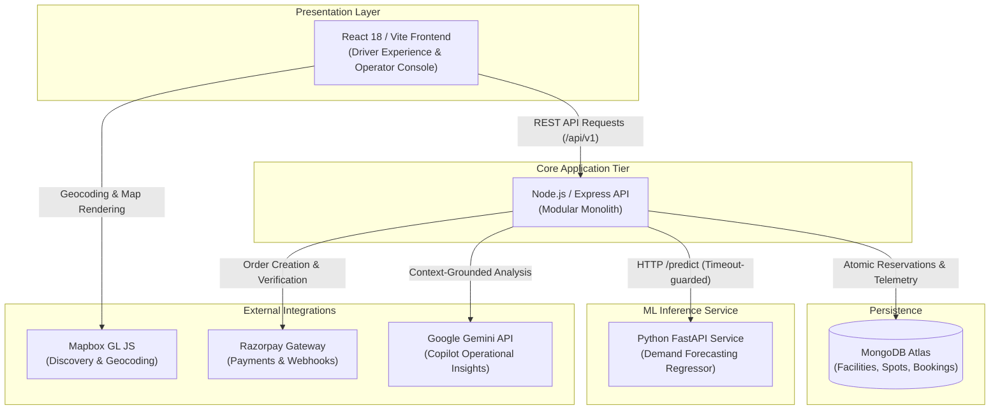
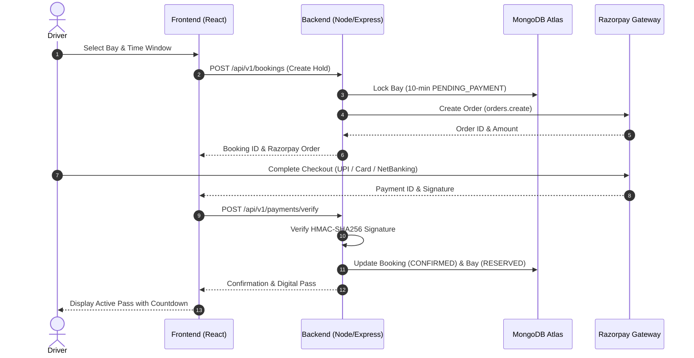

# ParkSpot

An AI-powered B2B parking operations and optimization platform connecting consumer drivers with available parking spaces while providing parking operators with real-time facility governance, dynamic pricing, and operational intelligence.

Live Demo: [https://parkspot-frontend.onrender.com/](https://parkspot-frontend.onrender.com/)

[](https://react.dev/)
[](https://nodejs.org/)
[](https://www.mongodb.com/)
[](https://fastapi.tiangolo.com/)

---

## Key Capabilities

### Driver Experience
- **Geographic Discovery:** Search destinations or use geolocation to find nearby parking facilities on an interactive Mapbox map.
- **Facility Telemetry:** View live vacancy counts, hourly rates, operating hours, and distance.
- **Exact Bay Reservation:** Inspect multi-level floor plans (Ground, Level 1, Level 2) and reserve specific bays with a 10-minute atomic hold.
- **Digital Passes:** Receive verifiable digital parking passes with active dwell countdowns and QR codes upon payment.
- **Secure Payments:** Integrated checkout via Razorpay supporting UPI, Cards, and Net Banking with cryptographic HMAC-SHA256 verification.

### Operator Console
- **Facility Governance:** Real-time visibility across all spots (`AVAILABLE`, `OCCUPIED`, `RESERVED`, `MAINTENANCE`).
- **Bay State Overrides:** Manually toggle space statuses with full audit logging.
- **Overstay Triage:** Monitor arrivals and detect vehicles remaining past their departure window.
- **Dynamic Pricing Recommendations:** Rule-based optimization suggesting peak surge rates or off-peak incentives.
- **ParkSpot Copilot:** Operational AI assistant powered by Google Gemini that analyzes grounded database metrics to answer operator queries.

---

## Technology Stack

| Component | Technologies | Purpose |
| :--- | :--- | :--- |
| **Frontend** | React 18, Vite, React Router 7 | Responsive SPA for driver discovery and operator console |
| **Mapping** | Mapbox GL JS | Vector tile maps, destination search, and geolocation markers |
| **Backend** | Node.js, Express 4 | Modular REST API (`/api/v1`) with versioned endpoints |
| **Database** | MongoDB Atlas, Mongoose 8 | Document storage for facilities, floors, spots, and bookings |
| **ML Inference** | Python, FastAPI, Scikit-learn | Separate microservice for 24-hour demand forecasting |
| **Security & Auth** | JWT, bcryptjs, otplib, Crypto | Role-based access control and AES-256-GCM encrypted TOTP 2FA |
| **Payments** | Razorpay REST API | Order creation and constant-time HMAC-SHA256 signature verification |
| **AI Assistant** | Google Gemini API | Grounded operational assistance and natural language reporting |

---

## System Architecture



---

## Booking & Payment Lifecycle



---

## Project Structure

```text
ParkSpot/
├── backend/            # Express REST API, auth, booking mutex, models & routes
├── frontend/           # React 18 + Vite SPA (Driver flow, Operator console, Maps)
├── ml/                 # Python FastAPI inference service & forecasting model
├── docs/               # System architecture documentation & API contracts
├── .env.example        # Environment variable template
└── package.json        # Root npm workspace configuration
```

---

## Local Setup

### 1. Prerequisites
- [Node.js](https://nodejs.org/) (v18+)
- [MongoDB](https://www.mongodb.com/) (Local or Atlas URI)
- [Python](https://www.python.org/) (3.10+, optional for ML forecasting)

### 2. Installation
```bash
git clone https://github.com/Kumud9/ParkSpot.git
cd ParkSpot
npm install
```

### 3. Environment Configuration
Copy the template and configure your local environment:
```bash
cp .env.example .env
```

Required environment variables (names only):
- `MONGODB_URI`: MongoDB connection string
- `JWT_SECRET`: Signing secret for JWT session tokens (min 32 characters)
- `TOTP_ENCRYPTION_KEY`: 32-byte key for AES-256-GCM 2FA secret encryption
- `VITE_MAPBOX_TOKEN`: Public Mapbox token for client-side map rendering
- `RAZORPAY_KEY_ID` / `RAZORPAY_KEY_SECRET`: Razorpay gateway credentials (optional for mock flow)
- `GEMINI_API_KEY`: Google Gemini API key for ParkSpot Copilot (optional)
- `ML_FORECAST_URL`: Endpoint for the Python FastAPI forecasting service (defaults to mock if offline)

### 4. Database Seeding & Development
```bash
# Seed initial test facilities, slots, and accounts
npm run db:seed

# Start backend (port 4000) and frontend (port 5173) concurrently
npm run dev

# Run automated test suites
npm test
```

---

## Architectural Principles & Operational Notes

- **100% Software-Derived Occupancy:** Space states and facility utilization are computed deterministically from booking holds, confirmed check-ins, operator overrides, and expiration sweeps—without physical sensors, loops, or camera hardware.
- **Separation of ML Inference:** The demand forecasting model runs as an independent Python FastAPI service. The Node.js backend communicates via timeout-guarded HTTP requests with automatic rule-based fallbacks.
- **Human-in-the-Loop AI:** ParkSpot Copilot utilizes Google Gemini solely to interpret and explain verified facility data in plain English; it cannot autonomously modify bookings, prices, or financial records.

---

## License

This project is licensed under the [MIT License](LICENSE).
