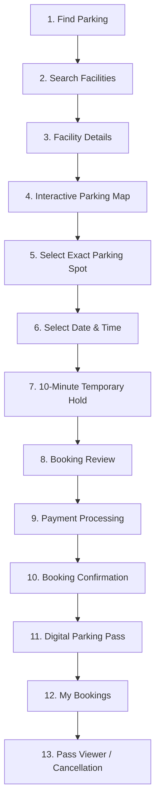

# Phase 4.1: ParkSpot Driver MVP Production Flow

## 1. Overview & Objective
Phase 4.1 elevates the ParkSpot driver experience into a continuous, production-grade end-to-end product journey. Rather than restructuring or rewriting components from scratch, existing components ([DriverExperience.jsx](file:///d:/ParkSpot/client/src/components/DriverExperience.jsx), [ParkingMap.jsx](file:///d:/ParkSpot/client/src/components/ParkingMap.jsx), [VehicleTopDown.jsx](file:///d:/ParkSpot/client/src/components/VehicleTopDown.jsx), [api.js](file:///d:/ParkSpot/client/src/services/api.js)) were preserved and progressively integrated with the live Express & MongoDB backend architecture.

---

## 2. Complete Driver Journey (13-Step Flow)



### Detailed Stage Breakdown:
1. **Find Parking & Discovery**: Drivers enter search destinations (e.g., *Connaught Place*, *Aerocity*, *Cyber City*) or select quick location chips. Live capacity metrics display available bay counts.
2. **Search Facilities**: Responsive cards display real-time status (`X SPOTS OPEN` or `FACILITY FULL`), standard hourly rates, operating hours, ratings, and distance.
3. **Facility Details**: High-level statistical overview showing total bays, occupied count, available spaces, and address breadcrumbs.
4. **Interactive Parking Map**: Top-down realistic asphalt parking layout with one-way driving lanes, entry/exit indicators, floor switching (`Ground Floor`, `Level 1`, `Level 2`), and visual top-down vehicles.
5. **Exact Spot Selection**: Available bays are clickable and keyboard-selectable. Occupied, reserved, maintenance, and blocked spots are disabled. Selection opens the Spot Details drawer without prematurely booking.
6. **Date & Time Selection**: Drivers configure reservation date, arrival time, dwell duration (1h to 24h), and optional vehicle registration plate. Real-time cost calculation runs dynamically.
7. **Temporary Hold**: A 10-minute hold countdown timer begins immediately (`MM:SS` in monospace typography). If the timer expires, the hold terminates, the selection is invalidated, and an expired hold modal directs the driver safely back to the map.
8. **Booking Review**: Concise pre-payment summary displaying facility, floor, spot, reservation window, dwell duration, and total payable amount with clear *Back* and *Confirm & Proceed* CTAs.
9. **Payment Processing**: Full integration with the backend payment workflow (`/api/v1/payments/order` and `/api/v1/payments/verify`), supporting UPI, Card, and Net Banking with loading states, signature verification, and decline/conflict error handling.
10. **Booking Confirmation**: Immediate visual confirmation with checkmark, booking reference ID, and direct access to the digital pass.
11. **Digital Parking Pass**: Software-based digital credential displaying brand header, assigned space in high contrast, arrival and departure windows, vehicle license plate, and verifiable credential token (`PS-PASS-...`).
12. **My Bookings**: Real backend data synchronization categorized into *All*, *Active & Upcoming*, *Completed*, and *Cancelled* reservations.
13. **Pass Viewer & Cancellation**: Clicking *View Pass* opens the full digital credential modal. Clicking *Cancel* triggers an explicit confirmation dialog and sends a cancellation patch to the backend API (`PATCH /api/bookings/:id/cancel`), updating UI state and releasing the spot.

---

## 3. Frontend Components Involved

| Component | File Path | Role & Enhancements |
| :--- | :--- | :--- |
| **`DriverExperience`** | [`client/src/components/DriverExperience.jsx`](file:///d:/ParkSpot/client/src/components/DriverExperience.jsx) | Orchestrates the entire 13-step driver journey, hold timer, payment state machine, pass rendering, and cancellation handling. |
| **`ParkingMap`** | [`client/src/components/ParkingMap.jsx`](file:///d:/ParkSpot/client/src/components/ParkingMap.jsx) | Renders signature top-down layout, balanced dynamic row partitioning for all slot schemas (`A-D`, `G-xx`, `L1-xx`), keyboard accessibility (`Enter`/`Space`), and ARIA states. |
| **`VehicleTopDown`** | [`client/src/components/VehicleTopDown.jsx`](file:///d:/ParkSpot/client/src/components/VehicleTopDown.jsx) | Vector rendering of top-down vehicle models within occupied and selected bays. |
| **`api` Service** | [`client/src/services/api.js`](file:///d:/ParkSpot/client/src/services/api.js) | Central API client layer connecting facilities, bookings, payment orders, payment verification, and driver authentication. |
| **Main App** | [`client/src/main.jsx`](file:///d:/ParkSpot/client/src/main.jsx) | Roots application state, syncs with backend health, passes live connection status, and coordinates global modes. |
| **Design Tokens** | [`client/src/styles.css`](file:///d:/ParkSpot/client/src/styles.css) | Defines ParkSpot 6-color palette, semantic parking states, pass card geometries, focus states, and mobile responsive media queries. |

---

## 4. API Endpoints Consumed

| Endpoint | HTTP Method | Auth Required | Purpose |
| :--- | :---: | :---: | :--- |
| `/api/health` | `GET` | No | Connectivity check to determine Live API vs Demo Mode. |
| `/api/auth/login` | `POST` | No | Auto-authenticates driver session (`user@parkspot.test`). |
| `/api/lots` | `GET` | No | Public discovery of parking facilities with capacity. |
| `/api/lots/:id` | `GET` | No | Public facility detail including all parking slots and optional time-window conflict checks. |
| `/api/bookings` | `GET` | Bearer Token | Fetches authenticated driver's real booking history. |
| `/api/bookings` | `POST` | Bearer Token | Creates a real booking record in MongoDB. |
| `/api/v1/payments/order` | `POST` | Bearer Token | Generates a payment order for the booking. |
| `/api/v1/payments/verify` | `POST` | Bearer Token | Verifies payment authorization and confirms booking. |
| `/api/bookings/:id/cancel` | `PATCH` | Bearer Token | Cancels an upcoming confirmed booking and logs event. |

---

## 5. Booking State Transitions

```
[Available Spot Selected] 
         ↓
    (10-Min Hold)
         ↓
  [PENDING_PAYMENT / CREATED]
         ↓
  (Payment Verified)
         ↓
   [CONFIRMED / ACTIVE]
         ↓
   ┌─────┴─────────────────────┐
   ↓                           ↓
(User Cancels)          (Reservation Ends)
   ↓                           ↓
[CANCELED]                [COMPLETED]
```

---

## 6. Temporary Hold Behavior
- Duration: Exactly 10 minutes (600 seconds).
- Visual Design: Sticky top bar with clock icon and monospace counter (`09:42`).
- Urgent State: Bar shifts to high-contrast red warning when fewer than 120 seconds remain.
- Expiration:
  - Halts payment processing immediately.
  - Invalidates the active spot selection.
  - Displays modal explaining the expiration and fair-access policy.
  - CTA button restarts the selection workflow on the parking map.

---

## 7. Payment Flow & State Machine
The payment flow supports three standard methods: **UPI**, **Credit/Debit Card**, and **Net Banking**.

State transitions:
1. `IDLE`: User selects payment method.
2. `PROCESSING`: Invokes `/api/bookings` then `/api/v1/payments/order` and `/api/v1/payments/verify`.
3. `SUCCESS`: Backend confirms signature verification; UI navigates to confirmation and generates digital pass.
4. `FAILED`: Backend rejects signature or gateway declines; displays error with retry button.
5. `CONFLICT`: Backend returns 409 `SLOT_UNAVAILABLE` (spot reserved by someone else); displays conflict notice with link to pick another spot.
6. `TIMEOUT`: Hold timer expired during transaction; halts processing and prompts re-selection.

---

## 8. Error & Edge Cases Handled

| Scenario | UI & System Behavior |
| :--- | :--- |
| **Spot Taken Before Confirmation** | Catches 409 conflict, preserves facility selection, presents clear alert banner: *"Spot was just reserved by another driver"*, with direct button to choose an alternative bay. |
| **Expired Hold** | Dedicated modal halts checkout, clears stale spot selection, and routes driver back to live map with refreshed availability. |
| **Payment Failure / Signature Error** | Displays error details from gateway verification; allows driver to change payment method or retry without losing reservation details. |
| **Backend Offline / Network Failure** | Falls back seamlessly to explicit Demo Mode with indicator pill and simulated payment flow. |
| **Invalid Form Inputs** | Inline validation prevents submission if date is in the past, time is missing, or duration is invalid. |
| **Cancellation of Past Booking** | Backend rejects cancellation for active or past bookings; UI presents clear explanation message. |
| **Empty Booking History** | Friendly empty-state illustration prompting the driver to discover parking. |

---

## 9. Demo Mode vs Live Mode Distinction
- **Live API Mode**: When `/api/health` responds with `status: "ok"`, the app uses live MongoDB data, executes real booking persistence, creates real payment orders, and validates cancellations via API.
- **Demo Mode**: Explicitly highlighted with an amber status pill (*Demo Mode*) and advisory notice. Mock facilities and simulated payments operate independently without corrupting or mixing with live database records.

---

## 10. Accessibility & UX Design Decisions
- **Brand Palette Compliance**: Strictly adheres to ParkSpot core colors (`#F4F2E7`, `#25221B`, `#E6DFD1`, `#707371`, `#F3F456`, `#B2A240`).
- **Semantic State Colors**: `#2E7D32` (Available), `#C62828` (Occupied), `#D97706` (Reserved), `#757575` (Maintenance), `#374151` (Blocked).
- **Non-Color Dependent Indicators**: Every spot features both textual labels (`OPEN`, `MAINT`, `BLOCKED`, `EV`, `ACC`) and realistic top-down vehicle icons.
- **Keyboard Navigation**: All available parking bays support `Tab`, `Enter`, and `Space` key activation with visible focus indicators (`:focus-visible`).
- **Screen Reader Support**: Full `aria-label`, `aria-pressed`, `aria-disabled`, and `role="button"` attributes across interactive components.
- **Responsive Layout**: On mobile viewports (`<= 768px`), parking map retains smooth touch scrolling, overhead stats collapse cleanly, and the spot details drawer remains easily reachable.
